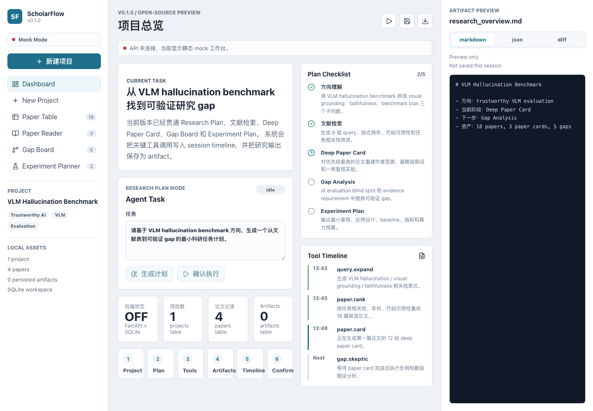
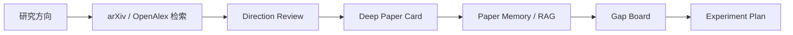

# ScholarFlow

面向 AI 研究者的中文、local-first、证据感知科研工作流。

ScholarFlow 将“输入研究方向”推进为一条可持续的研究流程：检索论文、阅读证据、建立项目记忆、分析研究空白，并生成可核验的实验计划。它不是论文搜索框，也不会把摘要包装成全文结论。

默认入口称为 **Research Workflow Run**：用户确认后，系统按固定、可恢复的工具图执行。它不是无限自治 Agent。可选模型只负责查询扩展、阅读计划建议、候选论断草稿与解释表达；证据等级、引用完整性、状态机、拒答和 Experiment readiness 始终由确定性代码决定。



> ScholarFlow v0.1.0 是 local-first 公开预览版。无需模型 API Key 即可启动；真实论文检索和开放 PDF 下载仍需要网络。

## 核心工作流



| 能力 | 当前实现 |
| --- | --- |
| 文献检索 | 从 arXiv、OpenAlex 检索、去重并排序，不用 demo 数据伪装真实结果 |
| 方向阅读 | 每轮阅读最多 10 篇强/中相关论文，最多 3 轮，持续更新方向理解 |
| Deep Paper Card | 基于可见证据生成 12 项阅读提纲，并标注字段级证据状态 |
| Research Memory / RAG | 在当前项目内检索论文记忆或原文片段，回答保留 citation 与拒答边界 |
| Gap Board | 从 limitation、失败模式、评测缺口和跨论文冲突中整理候选研究空白 |
| Experiment Plan | 围绕 claim、dataset、metric 和 baseline 生成复现或验证计划 |

## 证据边界

ScholarFlow 区分四种证据等级：

| 等级 | 含义 |
| --- | --- |
| `metadata_only` | 只有标题、作者、年份等元数据 |
| `abstract_only` | 已获得摘要，但未成功解析完整 PDF |
| `supplemental_text` | 用户补充文本，未通过 PDF 来源与解析验证 |
| `full_text` | PDF 文本已通过来源、解析状态和最小文本量校验 |

发现 `pdf_url` 或出现 `status=extracted` 都不能单独证明已读取全文；只有统一 evidence qualification 同时为 `level=full_text` 和 `verified=true` 才属于已验证 PDF 全文。扫描件、加密文件或没有文本层的 PDF 当前无法通过 OCR 处理。

原文 RAG 采用项目隔离的 chunk 索引、关键词与向量混合检索、相关性门槛和 claim-level citation 校验。没有可靠证据时返回 `no_reliable_hit`，而不是补写一个看似完整的答案。

> Citation 和证据质量分只说明“输出能否定位到当前证据”，不代表论文结论正确，也不能替代阅读全文、同行评审或复现实验。

## 快速开始

### 1. 环境要求

| 工具 | 要求 |
| --- | --- |
| Node.js | `^20.19.0` 或 `>=22.12.0`，推荐 Node.js 24 LTS |
| npm | `>=10` |
| Python | `>=3.11`，推荐 3.11 或 3.12 |
| Git | 较新版本 |

支持 macOS、Linux 和 WSL2。原生 Windows 尚未完成完整验证，建议使用 WSL2。

### 2. 安装

```bash
git clone https://github.com/lzhzwss121-hue/scholarflow.git
cd scholarflow

npm ci

python3 -m venv .venv
source .venv/bin/activate
python -m pip install --upgrade pip
python -m pip install -r services/api/requirements.txt

cp .env.example .env
npm run db:init
```

默认配置不需要模型 API Key。OpenAlex 匿名额度较小，长期使用建议在 `.env` 中配置免费的 `OPENALEX_API_KEY`。

### 3. 启动

终端 A：启动 API。

```bash
cd scholarflow
source .venv/bin/activate
npm run dev:api:reload
```

终端 B：启动 Web UI。

```bash
cd scholarflow
npm run dev:web
```

打开：

- Web UI：<http://127.0.0.1:5173/>
- OpenAPI：<http://127.0.0.1:8000/docs>

检查 API：

```bash
curl -fsS http://127.0.0.1:8000/health
```

预期返回：

```json
{"status":"ok","service":"scholarflow-api","version":"0.1.0"}
```

停止服务时，在两个终端中分别按 `Ctrl+C`。

## 推荐使用顺序

1. 创建研究项目，并输入一个具体问题或方向。
2. 检查检索结果是否与方向一致。
3. 运行 Direction Review，获得第一轮方向理解。
4. 打开 Paper Card，核对 PDF 状态与 12 项阅读提纲。
5. 在 Paper Memory 或原文 RAG 中针对已读论文提问。
6. 查看 Gap Board，排除证据不足的伪 gap。
7. 生成 Experiment Plan，再补齐代码、数据、算力和停止条件。

推荐输入：

```text
多模态大模型在视觉问答中的证据忠实性评估
RAG 系统中 citation faithfulness 的自动评估方法
医学图像分割中 prompt learning 的跨域泛化问题
```

避免只输入“AI”“大模型”或“图像”等过宽关键词。

## Deep Paper Card

每张 Paper Card 围绕以下问题组织：

1. 研究问题与背景
2. 已有研究与不足
3. 作者思路路径重建
4. 核心 intuition
5. 方法 pipeline
6. 数学与理论
7. 实验与 claim 验证
8. Takeaways
9. 最脆弱假设
10. 最小复现实验
11. 反例设计
12. 非增量 follow-up idea

卡片会分别标记 task、method、dataset、metric、baseline、claim 和 limitation 的证据状态。缺少字段时保留为缺失，不用通用科研话术补齐。完整协议见 [Deep Paper Card Protocol](docs/deep-paper-card.md)。

## RAG 与研究记忆

ScholarFlow 提供两条互不覆盖的查询通道：

- **Paper Memory**：检索结构化 Paper Card、Research Sight 与方向记忆。
- **原文 RAG**：检索摘要或已验证 PDF chunk，并返回可定位 citation。

原文 RAG 的主要流程：

```text
论文摘要 / 已验证 PDF
  -> 项目级 chunk 索引
  -> 关键词 + 向量混合检索
  -> 相关性过滤
  -> 证据受限回答
  -> citation 与 claim 校验
```

默认召回和回答均在本地运行：SQLite FTS5/BM25 负责词法召回，本地 lexical hash 只作为词面通道，回答只摘录命中证据。Lexical hash 不是语义 embedding。需要更强的语义检索或综合回答时，可以在后端环境变量中显式启用远程 provider；启用后，选中的文本或查询会发送给第三方服务。

## Gap Board 与 Experiment Plan

Gap Board 根据跨论文证据区分：

- `true_gap`：同一具体失败模式获得多篇独立全文证据支持，且不存在直接冲突。
- `engineering_gap`：具有工程价值，但研究新颖性或证据强度不足。
- `pseudo_gap`：表述宽泛、证据不足或被已有工作覆盖。

Experiment Plan 的状态包括：

- `ready`：科研锚点和执行条件均已确认。
- `partial`：研究问题成立，但代码、数据、算力或运行协议仍不完整。
- `blocked`：缺少合格 anchor paper，或关键约束无法满足。

项目只生成计划，不会自动下载数据集、训练模型或宣称实验成功。

## 技术架构

```text
apps/
  web/                  React + Vite 前端
  cli/                  本地服务与工作区 CLI
services/
  api/                  FastAPI、SQLite、检索与科研工作流
packages/
  schemas/              前后端共享 TypeScript 类型
docs/                   架构与阅读协议
examples/workflows/     公开示例
```

| 层级 | 技术 |
| --- | --- |
| 前端 | React、Vite、TypeScript |
| 后端 | FastAPI、Pydantic |
| 数据 | SQLite、本地 artifact |
| 检索 | arXiv、OpenAlex、开放 PDF |
| 可选模型服务 | OpenRouter、DeepSeek；默认使用本地确定性模式 |

更多设计说明见 [Architecture](docs/architecture.md)。

## 常用配置

复制 `.env.example` 后，大多数配置可直接使用：

| 变量 | 默认值 | 作用 |
| --- | --- | --- |
| `OPENALEX_API_KEY` | 空 | 提高 OpenAlex 可用额度 |
| `SCHOLARFLOW_MODEL_PROVIDER` | `local` | Workflow 建议 provider：`local`、`openrouter` 或 `deepseek` |
| `OPENROUTER_API_KEY` | 空 | 可选的 OpenRouter Workflow/RAG 服务 |
| `DEEPSEEK_API_KEY` | 空 | 可选的 DeepSeek Workflow 建议服务 |
| `SCHOLARFLOW_DB_PATH` | `services/api/.data/scholarflow.sqlite3` | 手动启动模式的数据库路径 |
| `SCHOLARFLOW_AUTO_FETCH_PDF` | `1` | 自动获取开放 PDF |
| `SCHOLARFLOW_PDF_MAX_BYTES` | `20971520` | PDF 下载与上传上限 |
| `SCHOLARFLOW_RAG_EMBEDDING_PROVIDER` | `local` | `local`、`openrouter` 或 `disabled` |
| `SCHOLARFLOW_RAG_GENERATION_PROVIDER` | `local` | `local`、`openrouter` 或 `disabled` |

不要提交真实 API Key；`.env` 已被 `.gitignore` 排除。完整参数和说明见 [.env.example](.env.example)。

## 开发命令

| 命令 | 作用 |
| --- | --- |
| `npm run dev:web` | 启动前端 |
| `npm run dev:api:reload` | 启动支持热重载的后端 |
| `npm run db:init` | 初始化数据库 |
| `npm run check` | TypeScript 与 CLI 检查 |
| `npm run build` | 构建前端和共享包 |
| `npm run test:e2e` | 运行 mocked API 的 Playwright smoke |
| `npm run health:api` | 运行后端导入与 health 函数 smoke |

运行后端测试：

```bash
source .venv/bin/activate
PYTHONPATH=services/api/src python -m unittest discover \
  -s services/api/tests -p "test_*.py"
```

## 可选：CLI 后台启动

安装依赖并配置 `.env` 后，可以用 CLI 同时管理前后端：

```bash
npm --workspace @scholarflow/cli run start -- init
npm --workspace @scholarflow/cli run start -- start
npm --workspace @scholarflow/cli run start -- status
npm --workspace @scholarflow/cli run start -- stop
```

CLI 默认使用 `~/.scholarflow/cache/scholarflow.sqlite3`，手动 npm 模式默认使用 `services/api/.data/scholarflow.sqlite3`。两种启动方式使用不同数据库，切换后看不到原项目通常不是数据被删除。

## 本地数据与隐私

ScholarFlow 默认绑定 `127.0.0.1`，当前没有用户认证或多租户隔离，请勿直接暴露到公网。

- 项目、论文、Paper Card、RAG chunk 和 artifact 主要保存在本地 SQLite。
- 论文检索会把检索词发送给 arXiv/OpenAlex。
- 开放 PDF 只允许从不含凭据的公开 HTTP/HTTPS URL 下载：下载前会解析全部 A/AAAA
  地址并拒绝任意非公网结果；每次重定向也会在连接下一跳前重新验证，HTTPS 不允许
  降级到 HTTP，且单次下载最多跟随 5 次重定向。
- 本地 PDF 原文件不落盘，但提取出的证据文本会写入 SQLite。
- 只有后端显式启用且存在有效 key 的远程 provider 才会发送相关输入；前端不能选择 provider。
- 模型调用只保存 provider、model、purpose、prompt version、时间、延迟、状态和 fallback 原因等非敏感审计字段。
- API key 不写入前端、SQLite、Artifact 或日志。

这些检查用于降低开放 PDF 下载的 SSRF 风险，但不应被描述为“完全消除 SSRF”。
DNS 校验与底层 socket 建立连接仍是两个时点，攻击者控制权威 DNS 时可能尝试 DNS
rebinding。生产部署仍应配合出站网络策略，禁止 API 进程访问内网和云元数据服务。

请勿提交 API Key、本地数据库、未公开论文、日志、私人研究笔记或未发表实验结果。更多说明见 [Security Policy](SECURITY.md)。

## 常见问题

<details>
<summary><code>npm ci</code> 出现 <code>EBADENGINE</code></summary>

Vite 要求 Node.js `^20.19.0` 或 `>=22.12.0`。升级到受支持版本，推荐 Node.js 24 LTS。

</details>

<details>
<summary>出现 <code>No module named uvicorn</code>、<code>dotenv</code> 或 <code>pypdf</code></summary>

确认已激活 `.venv`，然后重新安装后端依赖：

```bash
source .venv/bin/activate
python -m pip install -r services/api/requirements.txt
```

</details>

<details>
<summary>前端能打开，但显示 API 离线</summary>

前端和后端需要分别启动。先检查：

```bash
curl -fsS http://127.0.0.1:8000/health
```

若连接失败，请在已激活 `.venv` 的终端中重新运行 `npm run dev:api:reload`。

</details>

<details>
<summary>没有 API Key 能否运行？</summary>

可以。默认 Research Workflow Run 使用本地确定性工具图；如果后端选择了 OpenRouter/DeepSeek 但没有 key，UI 会明确显示 local fallback。论文检索仍需要连接 arXiv/OpenAlex。

</details>

<details>
<summary>为什么有 PDF 链接，证据仍是 <code>abstract_only</code>？</summary>

PDF URL 可能无法访问，文件也可能超过 20 MiB、加密、损坏、没有文本层，或解析出的有效正文不足。查看页面上的具体失败原因，也可以上传带文本层的本地 PDF。

</details>

<details>
<summary>检索为空或出现 OpenAlex 429</summary>

使用更具体的关键词、稍后重试，或配置免费的 `OPENALEX_API_KEY`。ScholarFlow 会显示降级 warning，不会用旧 demo 结果填充本次检索。

</details>

## 项目文档

- [架构说明](docs/architecture.md)
- [Deep Paper Card Protocol](docs/deep-paper-card.md)
- [示例工作流](examples/workflows/README.md)
- [Roadmap](ROADMAP.md)
- [贡献指南](CONTRIBUTING.md)
- [Release Notes](docs/release-notes/v0.1.0.md)

## 贡献与许可证

欢迎通过 Issue 或 Pull Request 改进检索质量、证据追踪、论文阅读、研究决策和中文交互。提交前请阅读 [CONTRIBUTING.md](CONTRIBUTING.md)。

本项目采用 [MIT License](LICENSE)。
