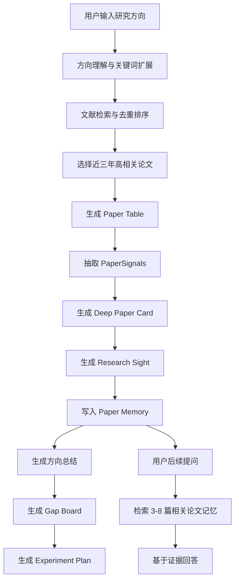

# ScholarFlow

面向人工智能领域的中文科研任务流程 Agent。

ScholarFlow 的目标不是做一个“论文搜索框”，而是把用户给出的研究方向、关键词或模糊 idea，转化为可以持续追踪、反复提问、继续推进的科研工作流。

它适合研究生、科研新手、AI 方向开发者和希望快速进入某个研究方向的用户使用。系统会围绕一个研究方向完成论文检索、方向综述、论文精读、记忆检索、研究空白分析和实验计划设计，帮助用户少做重复整理，多做真正有判断力的科研思考。

## 核心目标

| 目标 | ScholarFlow 的做法 |
| --- | --- |
| 降低新手入门门槛 | 用户只需要输入研究方向，系统会组织论文、背景、方法、实验和研究脉络 |
| 提高文献阅读效率 | 每篇论文生成结构化 Paper Card，包含摘要翻译和 12 条深度阅读分析 |
| 避免只输出模板总结 | 通过 PaperSignals、Evidence、Research Sight 标记论文的证据、缺口和脆弱假设 |
| 支持连续研究 | 每轮读取 10 篇论文，最多三轮累计 30 篇，并构建可检索的 Paper Memory |
| 辅助产生研究 idea | 从 limitation、benchmark 风险、baseline 对比和反例设计中寻找 follow-up 方向 |
| 支持实际复现 | 生成一周最小复现实验计划，明确 claim、dataset、metric 和 baseline |

## 能做什么

### 1. 研究方向理解

用户输入一个方向，例如：

```text
图像修复
多模态大模型幻觉
医学图像分割中的 prompt learning
RAG 系统中的证据忠实性评估
```

ScholarFlow 会先把方向拆解为更适合检索和分析的任务表达，包括研究对象、核心问题、潜在关键词、近似方向和需要避开的泛化表述。

### 2. 文献检索与排序

系统会检索并整理相关论文，重点面向近三年的高相关论文。检索结果会进入结构化 Paper Table：

| 字段 | 说明 |
| --- | --- |
| 论文标题 | 原始论文题目 |
| 年份 | 论文发表年份 |
| 作者 | 主要作者信息 |
| 来源 | arXiv、OpenAlex 等来源 |
| 类型 | Method、Benchmark、Survey、Analysis 等 |
| 相关性理由 | 为什么这篇论文和用户方向相关 |
| 优先级 | High、Medium、Low |
| 链接 | 原文或条目地址 |

如果外部检索源限流或没有返回结果，页面会显示空结果提示，不会把旧 demo 论文冒充为本次搜索结果。

### 3. 十篇论文一轮的方向精读

ScholarFlow 的方向阅读不是一次性塞给模型 30 篇论文，而是按轮次推进：

```text
第 1 轮：读取 10 篇论文
第 2 轮：继续读取 10 篇论文，并结合前 10 篇更新理解
第 3 轮：继续读取 10 篇论文，形成最多 30 篇论文的方向记忆
```

每轮结束后，系统会生成方向总结，说明：

- 这个方向真正解决的问题是什么。
- 近三年论文主要沿着哪些路线推进。
- 哪些方法是主流，哪些是新范式。
- 哪些 benchmark 或 metric 可能不可靠。
- 哪些论文最值得用户本人精读。
- 继续阅读下一轮时应该关注什么。

### 4. Deep Paper Card

每篇论文会生成一张可交互 Paper Card。用户点击论文卡片后，可以看到摘要翻译和深度阅读内容。

Paper Card 默认围绕 12 个问题展开：

1. 论文提出并解决的研究问题是什么？为什么重要？
2. 这个问题之前是否被解决？已有研究为什么不足？
3. 作者可能是如何从已有背景和失败模式中想到这个 idea 的？
4. 这篇论文的核心 intuition 是什么？
5. 具体方法是什么？输入、处理、输出 pipeline 如何运行？
6. 是否有关键数学推导？需要哪些理论背景？
7. 实验如何验证方法和 claim？
8. 这篇论文的 takeaways 是什么？
9. 最脆弱的假设是什么？
10. 如果只有一周，最小复现实验应该验证哪一点？
11. 如果反对这篇论文，应该如何设计反例？
12. 基于 limitation 和真实需求，可以提出什么有价值的 follow-up idea？

为了避免模板化输出，Paper Card 会先抽取 PaperSignals：

| Signal | 含义 |
| --- | --- |
| task | 论文解决的任务 |
| method | 核心方法或机制 |
| dataset | 使用的数据集 |
| metric | 评价指标 |
| claim | 论文主张 |
| limitation | 论文局限 |
| contribution_type | 贡献类型，例如 method、benchmark、survey、analysis |

如果缺少方法、实验、dataset 或 metric 信息，系统会明确写出“当前证据不足”，而不是编造泛泛解释。

### 5. Research Sight 科研判断

ScholarFlow 不只总结论文，还会尝试评价论文的科研质量。Research Sight 会关注四个维度：

| 维度 | 核心问题 |
| --- | --- |
| Motivation Sharpness | 它解决的是真痛点，还是伪需求？ |
| Elegance of Solution | 解法是否简洁、关键、可解释，还是只是堆模块？ |
| Evaluation Integrity | 实验是否真的验证了 claim？metric 是否可靠？ |
| Paradigm Shift | 它是否启发新范式，还是只是增量拼接？ |

系统会分别判断：

- 为什么好：论文真正有价值的地方在哪里。
- 为什么不好：核心假设、实验设计或落地成本哪里脆弱。
- 更好的角度：是否存在更简洁、更可靠或更有发表潜力的切入点。
- 证据边界：哪些判断有证据支持，哪些只是合理假设。

### 6. Paper Memory

ScholarFlow 会把已读论文转成结构化记忆，而不是依赖聊天窗口上下文硬记。

```text
30 篇论文
  -> 每篇生成结构化 Paper Card
  -> 每 10 篇生成 round summary
  -> 30 篇生成 direction memory
  -> 用户提问时按相关性检索 3-8 篇相关论文
  -> 模型基于检索结果回答
```

这样做的好处是：

- 不需要把 30 篇论文全文一直塞进上下文。
- 用户后续提问时，可以只召回最相关的论文片段。
- 回答可以指出依据来自哪些论文记忆。
- 长期项目可以持续积累方向理解。

### 7. Gap Board

Gap Board 用于整理研究空白和潜在方向。它不会简单输出“可以改进性能”，而是尝试从以下角度找 gap：

- 已有方法共同依赖的脆弱假设。
- benchmark 和真实场景之间的偏差。
- metric 无法反映的失败模式。
- 论文 claim 和实验设计之间的断层。
- 主流方法忽略的低成本替代范式。
- 不同论文之间互相矛盾的结论。

### 8. Experiment Plan

Experiment Plan 会从论文中选择适合复现的 anchor paper，并生成一周实验计划。

系统会优先选择同时具备以下信息的论文：

- 具体 claim。
- 明确 dataset。
- 明确 metric。
- 可对比 baseline。
- 非 survey、非 review、非 overview。

如果没有合格 anchor，系统会提示“缺少可复现 anchor”，而不是强行生成看似完整但不可执行的实验计划。

## 工作流



## 技术架构

```text
scholarflow/
  apps/
    web/                 React + Vite 前端
    cli/                 本地启动与工作区管理 CLI
  services/
    api/                 FastAPI 后端
      src/scholarflow_api/
        literature.py     文献检索
        direction_review.py 方向综述
        paper_card.py     深度论文卡片
        research_sight.py 科研判断
        research_memory.py 论文记忆检索
        research_decisions.py 实验计划与决策
        agent_core.py     Agent Loop 与模型调用
        database.py       SQLite 初始化与数据读写
  packages/
    schemas/             前后端共享类型
```

核心技术栈：

| 层级 | 技术 |
| --- | --- |
| 前端 | React、Vite、TypeScript |
| 后端 | FastAPI、Pydantic |
| 数据 | SQLite、本地 artifact |
| 模型 | OpenRouter 优先，可配置 DeepSeek 备用 |
| 检索 | arXiv、OpenAlex，可配置 Semantic Scholar、Crossref |
| 本地工具 | Node.js CLI、本地 workspace |

## 快速上手

### 1. 环境要求

请先确认本机具备：

```bash
node --version
npm --version
python3 --version
git --version
```

建议版本：

| 工具 | 版本 |
| --- | --- |
| Node.js | 20 或更高 |
| npm | 10 或更高 |
| Python | 3.11 或更高 |
| Git | 任意较新版本 |

### 2. 克隆项目

```bash
git clone git@github.com:lzhzwss121-hue/scholarflow.git
cd scholarflow
```

### 3. 安装前端依赖

```bash
npm install
```

### 4. 安装后端依赖

```bash
python3 -m venv .venv
source .venv/bin/activate
python -m pip install -r services/api/requirements.txt
```

### 5. 配置环境变量

复制示例配置：

```bash
cp .env.example .env
```

编辑 `.env`，至少填写：

```bash
SCHOLARFLOW_MODEL_PROVIDER=openrouter
OPENROUTER_API_KEY=你的 OpenRouter API Key
OPENROUTER_MODEL=minimax/minimax-m2.5
OPENROUTER_FAST_MODEL=minimax/minimax-m2.5
OPENROUTER_RAG_MODEL=qwen/qwen3-embedding-8b
```

如果希望减少 OpenAlex 或 Crossref 请求限制，可以补充：

```bash
OPENALEX_EMAIL=你的邮箱
CROSSREF_MAILTO=你的邮箱
```

本地开发时，可以在启动前加载 `.env`：

```bash
set -a
source .env
set +a
```

### 6. 初始化数据库

```bash
npm run db:init
```

默认数据库位置：

```text
services/api/.data/scholarflow.sqlite3
```

### 7. 启动后端

开发时推荐使用 reload：

```bash
npm run dev:api:reload
```

默认 API 地址：

```text
http://127.0.0.1:8000
```

### 8. 启动前端

另开一个终端：

```bash
npm run dev:web
```

浏览器打开：

```text
http://127.0.0.1:5173
```

## 使用 CLI 一键启动

如果不想分别启动前端和后端，可以使用内置 CLI：

```bash
npm --workspace @scholarflow/cli run start -- init
npm --workspace @scholarflow/cli run start -- start
```

默认服务：

| 服务 | 地址 |
| --- | --- |
| Web UI | `http://127.0.0.1:5173` |
| API | `http://127.0.0.1:8000` |
| 本地工作区 | `~/.scholarflow` |

查看状态：

```bash
npm --workspace @scholarflow/cli run start -- status
```

停止服务：

```bash
npm --workspace @scholarflow/cli run start -- stop
```

指定工作区：

```bash
SCHOLARFLOW_WORKSPACE=/path/to/workspace npm --workspace @scholarflow/cli run start -- init
SCHOLARFLOW_WORKSPACE=/path/to/workspace npm --workspace @scholarflow/cli run start -- start
```

## 推荐使用方式

1. 打开 Web UI。
2. 创建一个新的研究项目。
3. 输入一个具体研究方向，不要只输入过宽的词。
4. 先检索论文，检查返回论文是否真的符合方向。
5. 运行 Direction Review，获得第一轮方向理解。
6. 打开 Paper Card，逐篇查看摘要翻译和 12 条分析。
7. 使用 Paper Memory 针对已读论文提问。
8. 查看 Gap Board，筛选可能有价值的研究空白。
9. 生成 Experiment Plan，确认是否存在一周内可验证的实验切口。
10. 如果还想继续深入同一方向，再进入下一轮阅读。

更好的输入示例：

```text
多模态大模型在视觉问答中的证据忠实性评估
扩散模型用于盲图像修复时的可控性问题
RAG 系统中 citation faithfulness 的自动评估方法
医学图像分割中 prompt learning 的跨域泛化问题
```

不推荐的输入：

```text
AI
大模型
图像
深度学习
```

## 开发命令

| 命令 | 作用 |
| --- | --- |
| `npm run dev:web` | 启动前端 |
| `npm run dev:api` | 启动后端 |
| `npm run dev:api:reload` | 以 reload 模式启动后端 |
| `npm run db:init` | 初始化开发数据库 |
| `npm run check` | 运行 TypeScript 和 CLI 检查 |
| `npm run build` | 构建前端和共享包 |
| `npm run health:api` | 检查 API health |
| `npm run version:cli` | 查看 CLI 版本 |

Python 语法检查：

```bash
python3 -m compileall services/api/src/scholarflow_api
```

## 本地数据与隐私

ScholarFlow 是 local-first 项目。CLI 默认将运行数据保存在：

```text
~/.scholarflow/
  config.yaml
  projects/
  artifacts/
  logs/
  cache/
    scholarflow.sqlite3
    services.json
```

请不要提交以下内容：

- API Key。
- 本地 SQLite 数据库。
- 未公开论文 PDF。
- 用户 artifact。
- 日志文件。
- 私人研究笔记。
- 未发表实验结果。

## 常见问题

### 浏览器打不开 `http://127.0.0.1:5173`

先确认前端是否启动：

```bash
npm run dev:web
```

如果端口被占用，可以查看终端输出中的新端口，或先停止旧服务：

```bash
npm --workspace @scholarflow/cli run start -- stop
```

### 前端能打开，但没有真实模型输出

确认已经加载模型配置：

```bash
set -a
source .env
set +a
```

然后重新启动后端：

```bash
npm run dev:api:reload
```

### OpenAlex 返回 429

429 表示外部论文检索源暂时限流。可以：

- 稍后重试。
- 配置 `OPENALEX_EMAIL`。
- 换一个更具体的关键词。
- 优先使用已有检索结果继续分析。

ScholarFlow 不会把旧论文冒充成本次检索结果。

### 应该用 Web UI 还是 CLI

普通用户优先使用 Web UI。CLI 主要用于：

- 初始化本地工作区。
- 启动或停止服务。
- 查看服务状态。
- 管理本地开发环境。

## 设计原则

ScholarFlow 会尽量遵循以下原则：

- 中文优先，但不强行翻译技术术语。
- 证据优先，缺少证据时明确说明。
- 不把摘要包装成洞见。
- 不把 survey 当成可复现实验 anchor。
- 不依赖聊天上下文硬记 30 篇论文。
- 不为了生成完整答案而编造 dataset、metric 或 claim。
- 输出应该服务于用户继续读论文、做实验和形成研究判断。

## 许可证

MIT
