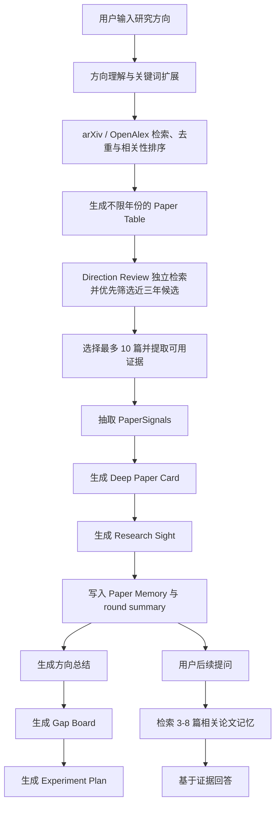

# ScholarFlow

面向人工智能领域的中文科研任务流程 Agent。

ScholarFlow 的目标不是做一个“论文搜索框”，而是把用户给出的研究方向、关键词或模糊 idea，转化为可以持续追踪、反复提问、继续推进的科研工作流。

它适合研究生、科研新手、AI 方向开发者和希望快速进入某个研究方向的用户使用。系统会围绕一个研究方向完成论文检索、方向综述、证据受限的论文阅读辅助、记忆检索、研究空白分析和实验计划设计，帮助用户少做重复整理，多做真正有判断力的科研思考。

> 第一次运行？直接跳到[快速上手](#快速上手)。建议先使用无 Key 模式确认前后端、SQLite 和论文检索均正常，再配置 OpenRouter。

## 核心目标

| 目标 | ScholarFlow 的做法 |
| --- | --- |
| 降低新手入门门槛 | 用户只需要输入研究方向，系统会组织论文、背景、方法、实验和研究脉络 |
| 提高文献阅读效率 | 生成结构化 Paper Card，包含摘要阅读概述和 12 项启发式阅读提纲 |
| 明确证据边界 | 通过 PaperSignals、Evidence、Research Sight 标记可见证据、缺口和脆弱假设 |
| 支持连续研究 | 每轮目标最多读取 10 篇论文，最多三轮累计 30 篇，并逐轮更新 Paper Memory |
| 辅助产生研究 idea | 从 limitation、benchmark 风险、baseline 对比和反例设计中寻找 follow-up 方向 |
| 辅助制定复现计划 | 生成一周最小复现实验计划，明确 claim、dataset、metric 和 baseline；项目本身不执行训练 |

## 能做什么

### 1. 研究方向理解

用户输入一个方向，例如：

```text
图像修复
多模态大模型幻觉
医学图像分割中的 prompt learning
RAG 系统中的证据忠实性评估
```

ScholarFlow 会先把方向拆解为更适合检索和分析的任务表达，包括研究对象、核心问题、潜在关键词、近似方向和需要避开的泛化表述。

### 2. 文献检索与排序

系统会从 arXiv 和 OpenAlex 检索、去重并按相关性整理候选论文。普通 Paper Table 不做近三年硬过滤；Direction Review 会在年份已知时优先筛选近三年的高相关候选。

项目论文资产采用累计 upsert：重新检索会更新同一论文并加入新论文，不会先删除已有论文，也不会解除既有 Paper Card、Memory 与论文记录的绑定。页面中的候选、通过门槛和过滤统计仍表示最近一轮检索覆盖。

| 字段 | 说明 |
| --- | --- |
| 论文标题 | 原始论文题目 |
| 年份 | 论文发表年份 |
| 作者 | 主要作者信息 |
| 来源 | arXiv、OpenAlex 等来源 |
| 类型 | arXiv 通常为 `Preprint`；OpenAlex 保留上游 work type |
| 相关性理由 | 为什么这篇论文和用户方向相关 |
| 优先级 | High、Medium、Watch |
| 链接 | 原文或条目地址 |

如果外部检索源限流或没有返回结果，页面会显示空结果提示，不会把旧 demo 论文冒充为本次搜索结果。

### 3. 每轮最多十篇论文的方向阅读

ScholarFlow 的方向阅读不是一次性处理 30 篇论文，而是按轮次推进：

```text
第 1 轮：目标读取最多 10 篇论文
第 2 轮：继续读取最多 10 篇，并结合已有记忆更新理解
第 3 轮：继续读取最多 10 篇，形成累计最多 30 篇的方向记忆
```

如果强/中相关候选不足，结果会明确标记为 `partial` 或 `blocked`，不会用弱相关论文强行补满 10 篇。

一轮是否 `complete` 由实际完成结构化阅读的强/中相关论文数决定；被过滤的弱相关或离题候选只作为检索质量 warning 展示，不会在已经读满目标数量时把该轮错误降级为 `partial`。

每轮结束后，系统会生成方向总结，说明：

- 这个方向真正解决的问题是什么。
- 近三年论文主要沿着哪些路线推进。
- 哪些方法是主流，哪些是新范式。
- 哪些 benchmark 或 metric 可能不可靠。
- 哪些论文最值得用户本人精读。
- 继续阅读下一轮时应该关注什么。

### 4. Deep Paper Card

每篇入选论文会生成一张可交互 Paper Card。用户点击卡片后，可以看到摘要阅读概述和 12 项启发式阅读提纲。当前版本不提供逐句机器翻译，也不应把这些提纲当作专家精读或同行评审的替代品。

Paper Card 默认围绕 12 个问题展开：

1. 论文提出并解决的研究问题是什么？为什么重要？
2. 这个问题之前是否被解决？已有研究为什么不足？
3. 作者可能是如何从已有背景和失败模式中想到这个 idea 的？
4. 这篇论文的核心 intuition 是什么？
5. 具体方法是什么？输入、处理、输出 pipeline 如何运行？
6. 是否有关键数学推导？需要哪些理论背景？
7. 实验如何验证方法和 claim？
8. 这篇论文的 takeaways 是什么？
9. 最脆弱的假设是什么？
10. 如果只有一周，最小复现实验应该验证哪一点？
11. 如果反对这篇论文，应该如何设计反例？
12. 基于 limitation 和真实需求，可以提出什么有价值的 follow-up idea？

为了让阅读提纲尽量绑定可见证据，Paper Card 会先抽取 PaperSignals：

| Signal | 含义 |
| --- | --- |
| task | 论文解决的任务 |
| method | 核心方法或机制 |
| dataset | 使用的数据集 |
| metric | 评价指标 |
| claim | 论文主张 |
| limitation | 论文局限 |
| contribution_type | 贡献类型，例如 method、benchmark、survey、analysis |

如果缺少方法、实验、dataset 或 metric 信息，系统会明确写出“当前证据不足”，而不是编造泛泛解释。

Direction Review 和单篇 Paper Card 会优先尝试解析 arXiv/OpenAlex 提供的开放 PDF。PDF 最多处理 80 页并保留最多 50,000 个正文字符；只有提取文本达到 PDF 校验阈值时才会标记为 `full_text`，同时记录来源、解析页数、字符数和失败原因。自动获取失败时，可以在阅读页上传本地 PDF 或粘贴关键正文片段；粘贴文本使用启发式证据等级，不等同于完整 PDF 核验。12 项提纲使用目录切换，一次只显示一项。

### 5. Research Sight 科研判断

ScholarFlow 不只整理摘要，还会生成一份启发式科研判断草稿。Research Sight 关注四个维度，但其结论仍需用户回到原文核验：

| 维度 | 核心问题 |
| --- | --- |
| Motivation Sharpness | 它解决的是真痛点，还是伪需求？ |
| Elegance of Solution | 解法是否简洁、关键、可解释，还是只是堆模块？ |
| Evaluation Integrity | 实验是否真的验证了 claim？metric 是否可靠？ |
| Paradigm Shift | 它是否启发新范式，还是只是增量拼接？ |

系统会分别判断：

- 为什么好：论文真正有价值的地方在哪里。
- 为什么不好：核心假设、实验设计或落地成本哪里脆弱。
- 更好的角度：是否存在更简洁、更可靠或更有发表潜力的切入点。
- 证据边界：哪些判断有证据支持，哪些只是合理假设。

### 6. Paper Memory

ScholarFlow 会把已读论文转成结构化记忆，而不是依赖聊天窗口上下文硬记。

```text
最多 30 篇论文
  -> 每篇生成结构化 Paper Card
  -> 每轮结束生成 round summary
  -> 每轮更新 direction memory
  -> 用户提问时按相关性检索 3-8 篇相关论文
  -> 系统基于检索结果生成证据受限回答
```

这样做的好处是：

- 不需要把 30 篇论文全文一直塞进上下文。
- 用户后续提问时，可以只召回最相关的论文片段。
- 回答可以指出依据来自哪些论文记忆。
- 长期项目可以持续积累方向理解。

#### RAG 第一阶段：可追溯原文索引

ScholarFlow 会把真实摘要或已验证 PDF 文本切成项目隔离的 `paper_chunks`，为后续混合检索和向量 RAG 提供底座。每个 chunk 保留：

- `project_id` 与 `paper_id`。
- `metadata.abstract`、`pdf.full_text` 或 `user_provided.full_text` 证据来源。
- PDF section、起止页码和原文内容。
- chunk 顺序、字符数、token 估算和 SHA-256 校验值。
- 索引版本以及尚未填充的 embedding 模型、维度和向量字段。

论文刚进入 Paper Table 时，存在真实摘要就建立 `abstract_only` 索引；开放 PDF、上传 PDF 或绑定论文的手动正文成功达到全文阈值后，会原子替换为 `full_text` 索引。重复检索不会把已经建立的全文索引降级为摘要索引。当前阶段尚未计算 embedding，也尚未用大模型生成 RAG 回答，`embedding_status=not_started` 是正常状态。

可以通过 OpenAPI 文档调用以下接口：

```text
GET  /projects/{project_id}/rag-index
GET  /projects/{project_id}/papers/{paper_id}/rag-index
GET  /projects/{project_id}/papers/{paper_id}/chunks
POST /projects/{project_id}/papers/{paper_id}/rag-index
DELETE /projects/{project_id}/papers/{paper_id}/rag-index
```

手动重建时，POST body 可以提供 `{"paper_text": "..."}`；留空则重新尝试获取论文的开放 PDF。失败的重建不会删除已有的高等级索引。`DELETE` 只清除该论文的本地 chunks，不会删除论文记录、Paper Card 或 Memory。

### 7. Gap Board

Gap Board 用于整理研究空白和潜在方向。它不会简单输出“可以改进性能”，而是尝试从以下角度找 gap：

- 已有方法共同依赖的脆弱假设。
- benchmark 和真实场景之间的偏差。
- metric 无法反映的失败模式。
- 论文 claim 和实验设计之间的断层。
- 主流方法忽略的低成本替代范式。
- 不同论文之间互相矛盾的结论。

### 8. Experiment Plan

Experiment Plan 会从论文中选择适合复现的 anchor paper，并生成一周实验计划，但不会替用户下载数据集、运行训练或验证实验结果。

系统会优先选择同时具备以下信息的论文：

- 具体 claim。
- 明确 dataset。
- 明确 metric。
- 可对比 baseline。
- 非 survey、非 review、非 overview。

如果没有合格 anchor，系统会提示“缺少可复现 anchor”，而不是强行生成看似完整但不可执行的实验计划。

## 工作流



## 技术架构

```text
scholarflow/
  apps/
    web/                 React + Vite 前端
    cli/                 本地启动与工作区管理 CLI
  services/
    api/                 FastAPI 后端
      src/scholarflow_api/
        literature.py     文献检索
        direction_review.py 方向综述
        full_text.py      开放 PDF 下载、校验与正文抽取
        paper_card.py     深度论文卡片
        research_sight.py 科研判断
        research_memory.py 论文记忆检索
        research_decisions.py 实验计划与决策
        agent_core.py     Agent Loop 与模型调用
        database.py       SQLite 初始化与数据读写
  packages/
    schemas/             前后端共享类型
```

核心技术栈：

| 层级 | 技术 |
| --- | --- |
| 前端 | React、Vite、TypeScript |
| 后端 | FastAPI、Pydantic |
| 数据 | SQLite、本地 artifact |
| 模型 | OpenRouter（当前用于 Research Plan）与本地确定性 fallback |
| 检索 | arXiv、OpenAlex；开放 PDF 自动解析与本地 PDF 上传 |
| 本地工具 | Node.js CLI、本地 workspace |

## 目录说明

| 文件或目录 | 作用 |
| --- | --- |
| `apps/web/` | 网页界面 |
| `apps/web/.env.example` | 可选的前端 API 地址与超时模板 |
| `apps/cli/` | 本地命令 |
| `services/api/` | 后端服务 |
| `packages/schemas/` | 共享类型 |
| `docs/` | 项目文档 |
| `examples/` | 示例流程 |
| `.github/` | 开源协作 |
| `.env.example` | 环境模板 |
| `README.md` | 项目说明 |
| `ROADMAP.md` | 后续路线 |
| `CONTRIBUTING.md` | 贡献指南 |
| `SECURITY.md` | 安全说明 |
| `package.json` | 项目脚本 |
| `package-lock.json` | 依赖锁定 |

## 当前实现范围

> [!IMPORTANT]
> ScholarFlow v0.1.0 可以在没有模型 API Key 的情况下启动，但此时 Agent Plan 使用本地确定性 fallback。当前唯一会发起远程模型请求的提供方是 OpenRouter，而且只用于 Research Plan；Direction Review、Paper Card、Memory、Gap Board 和 Experiment Plan 目前主要由本地检索、证据抽取与规则逻辑生成。直接 DeepSeek API、OpenAI API、Semantic Scholar 和 Crossref 尚未接入，请不要把预留环境变量理解为已经可用的连接器。

当前实际论文检索源是 arXiv 和 OpenAlex。arXiv 无需 API Key；OpenAlex 目前只给匿名请求很小的每日试用额度，正常使用应申请免费的 `OPENALEX_API_KEY`。首次真实检索和开放 PDF 下载必须能够访问互联网。PDF 解析依赖文本层，不包含 OCR；扫描件、加密文件或没有文本层的 PDF 可能无法解析。

## 快速上手

以下步骤以 macOS、Linux 或 WSL2 为准。原生 Windows 尚未完成完整验证，建议 Windows 用户使用 WSL2。

推荐第一次运行时使用“两个终端分别启动”的方式，便于直接看到前后端错误。CLI 后台启动适合依赖和环境变量已经验证无误之后使用。

### 1. 检查环境

```bash
node --version
npm --version
python3 --version
git --version
curl --version
```

| 工具 | 支持范围 | 推荐 |
| --- | --- | --- |
| Node.js | `^20.19.0` 或 `>=22.12.0` | Node.js 24 LTS |
| npm | `>=10` | 随 Node.js LTS 安装的稳定版本 |
| Python | `>=3.11` | Python 3.11 或 3.12 |
| Git | 较新版本 | 支持 HTTPS clone 即可 |
| curl | 可访问 localhost HTTP | 用于真实 health 检查 |

如果 Node.js 只是 `20.0` 至 `20.18`，Vite 可能无法启动；Node.js 20 目前也已进入上游 EOL。新安装请优先使用 [Node.js 24 LTS](https://nodejs.org/en/download)。Python 缺失或低于 3.11 时，请从 [Python Downloads](https://www.python.org/downloads/) 安装受支持版本，完成后重新运行上面的版本检查。

Windows 用户建议先在管理员 PowerShell 执行 `wsl --install`，重启后打开 WSL 的 Ubuntu shell，并在 WSL 内完成本文后续命令。详见 [Install WSL](https://learn.microsoft.com/windows/wsl/install)。

### 2. 克隆仓库

下面默认把仓库克隆到当前用户 home 目录。没有配置 GitHub SSH Key 时，使用 HTTPS：

```bash
cd ~
git clone https://github.com/lzhzwss121-hue/scholarflow.git
cd scholarflow
```

已经配置 SSH Key 时也可以使用：

```bash
cd ~
git clone git@github.com:lzhzwss121-hue/scholarflow.git
cd scholarflow
```

后续命令都应在仓库根目录执行，不要只进入 `apps/web` 安装依赖，因为前端还依赖 workspace 中的 `packages/schemas`。

### 3. 安装 Node.js 与 Python 依赖

仓库包含 `package-lock.json`，首次安装推荐使用可复现的 `npm ci`：

```bash
npm ci
```

创建独立 Python 虚拟环境并安装完整后端依赖：

```bash
python3 -m venv .venv
source .venv/bin/activate
python -m pip install --upgrade pip
python -m pip install -r services/api/requirements.txt
```

确认 PDF 解析等关键依赖已经装入当前虚拟环境：

```bash
python -c "import fastapi, uvicorn, dotenv, certifi, pypdf; print('backend dependencies OK', pypdf.__version__)"
```

如果这里出现 `ModuleNotFoundError`，请确认命令行前面显示虚拟环境名称 `(.venv)`，然后重新执行 requirements 安装命令。

### 4. 创建本地配置

```bash
cp .env.example .env
```

可以使用任意文本编辑器修改，例如 `nano .env`；保存后需要重启后端才能重新加载配置。

只想先验证本地界面和工作流、暂时没有模型 Key 时，复制后的模板已经是安全的“无模型 Key fallback 模式”，关键配置如下：

```dotenv
SCHOLARFLOW_MODEL_PROVIDER=openrouter
OPENROUTER_API_KEY=
OPENALEX_API_KEY=
SCHOLARFLOW_AUTO_FETCH_PDF=1
```

Web UI 当前会显式请求 `openrouter` provider；当 `OPENROUTER_API_KEY` 为空时，后端会立即退回本地确定性计划，不会请求 OpenRouter。`SCHOLARFLOW_MODEL_PROVIDER=local` 只影响没有显式传入 provider 的 API 调用，不能用于切换当前 Web 流程。

希望使用真实 OpenRouter 模型生成 Research Plan 时：

```dotenv
SCHOLARFLOW_MODEL_PROVIDER=openrouter
OPENROUTER_API_KEY=你的真实_OpenRouter_API_Key
OPENROUTER_MODEL=minimax/minimax-m2.5
OPENALEX_API_KEY=你的免费_OpenAlex_API_Key
SCHOLARFLOW_AUTO_FETCH_PDF=1
```

OpenAlex 官方已在 2026 年用 API Key 体系替代 polite pool，`mailto` 参数会被忽略。免费 Key 可在 [OpenAlex Authentication & Pricing](https://developers.openalex.org/api-reference/authentication) 指引的账户设置页获取。没有 OpenAlex Key 时 ScholarFlow 仍可依赖 arXiv，并会在 OpenAlex 额度耗尽或请求失败时显示降级 warning。不要把任何真实 API Key 提交到 Git；`.env` 已被 `.gitignore` 排除。

后端会自动读取仓库根目录的 `.env`。默认端口下，前端不需要额外环境变量：它会请求 `http://127.0.0.1:8000`，普通请求超时 30 秒，研究任务超时 90 秒。

> [!NOTE]
> 当前 Vite root 是 `apps/web`，因此仓库根目录 `.env` 里的 `VITE_` 变量不会自动被手动启动的前端读取。默认端口不受影响；如需自定义 API 地址或超时，请使用启动命令前的 shell 环境变量，或新建 `apps/web/.env.local`。

### 5. 初始化手动模式数据库

保持 `.venv` 激活：

```bash
npm run db:init
```

默认会创建：

```text
services/api/.data/scholarflow.sqlite3
```

API 启动时也会自动运行数据库初始化；显式执行这一步可以提前发现 Python 环境、目录权限或数据库迁移问题。

### 6. 启动后端（终端 A）

下面的路径对应前文推荐的 home 目录克隆方式；如果仓库保存在别处，请替换 `~/scholarflow`。

```bash
cd ~/scholarflow
source .venv/bin/activate
npm run dev:api:reload
```

保持该终端运行。默认地址：

- API：`http://127.0.0.1:8000`
- OpenAPI 文档：`http://127.0.0.1:8000/docs`

保持终端 A 运行。在准备启动前端的终端 B 中，先验证真实 HTTP 服务：

```bash
curl -fsS http://127.0.0.1:8000/health
curl -fsS http://127.0.0.1:8000/projects
```

`/health` 的预期返回为：

```json
{"status":"ok","service":"scholarflow-api","version":"0.1.0"}
```

`npm run health:api` 只是进程内导入检查，不会访问 8000 端口，因此不能代替上面的 `curl`。

### 7. 启动前端（终端 B）

```bash
cd ~/scholarflow
npm run dev:web
```

打开：

```text
http://127.0.0.1:5173/
```

第一次使用可以直接进入 `http://127.0.0.1:5173/#new-project` 创建项目。创建成功后会进入 Paper Table；完成论文检索后再进入 Direction Review。只打开前端而没有启动后端时，页面外壳仍可能显示，但创建项目、检索和精读功能不可用。

停止服务时，在两个终端中分别按 `Ctrl+C`。

### 8. 启动成功检查

- `curl http://127.0.0.1:8000/health` 返回 `status: ok`。
- `http://127.0.0.1:5173/` 能打开，并且页面没有显示 API 离线提示。
- 能够创建一个真实项目并在刷新页面后继续看到它。
- 能够发起 arXiv/OpenAlex 检索；如果网络或上游受限，页面应显示明确 warning，而不是 demo 结果。

## 依赖安装后的 CLI 后台启动

完成 `npm ci`、Python requirements 安装和 `.env` 配置后，可以让 CLI 在后台同时启动前后端。`init` 只创建本地工作区目录和配置，不会安装依赖；`start` 也不会等待 HTTP health 检查成功。

```bash
npm --workspace @scholarflow/cli run start -- init
npm --workspace @scholarflow/cli run start -- start
```

默认服务：

| 服务 | 地址 |
| --- | --- |
| Web UI | `http://127.0.0.1:5173` |
| API | `http://127.0.0.1:8000` |
| 本地工作区 | `~/.scholarflow` |
| SQLite | `~/.scholarflow/cache/scholarflow.sqlite3` |

启动后同时检查进程状态和真实 HTTP 服务：

```bash
npm --workspace @scholarflow/cli run start -- status
curl -fsS http://127.0.0.1:8000/health
```

`status` 只检查记录的 PID 是否存在。如果显示 `running` 但网页打不开，请查看：

```bash
tail -n 100 ~/.scholarflow/logs/api.log
tail -n 100 ~/.scholarflow/logs/web.log
```

停止 CLI 记录的服务：

```bash
npm --workspace @scholarflow/cli run start -- stop
```

指定工作区或端口：

```bash
npm --workspace @scholarflow/cli run start -- init --workspace /path/to/workspace
npm --workspace @scholarflow/cli run start -- start --workspace /path/to/workspace --api-port 8001 --web-port 5174
```

> [!WARNING]
> 手动模式默认读取 `services/api/.data/scholarflow.sqlite3`，CLI 模式则强制使用当前 workspace 下的 `cache/scholarflow.sqlite3`。两种模式不要混用并期待看到同一批项目；切换启动方式后“项目消失”通常只是连接到了不同 SQLite 文件。

## 推荐使用方式

1. 打开 Web UI。
2. 创建一个新的研究项目。
3. 输入一个具体研究方向，不要只输入过宽的词。
4. 先检索论文，检查返回论文是否真的符合方向。
5. 运行 Direction Review，获得第一轮方向理解。
6. 打开 Paper Card，逐篇查看摘要阅读概述和 12 项启发式提纲。
7. 使用 Paper Memory 针对已读论文提问。
8. 查看 Gap Board，筛选可能有价值的研究空白。
9. 生成 Experiment Plan，确认是否存在一周内可验证的实验切口。
10. 如果还想继续深入同一方向，再进入下一轮阅读。

更好的输入示例：

```text
多模态大模型在视觉问答中的证据忠实性评估
扩散模型用于盲图像修复时的可控性问题
RAG 系统中 citation faithfulness 的自动评估方法
医学图像分割中 prompt learning 的跨域泛化问题
```

不推荐的输入：

```text
AI
大模型
图像
深度学习
```

Direction Review 会独立检索候选并尝试并发下载开放 PDF，通常比普通 Paper Table 检索更慢。前端为研究任务预留 90 秒；开放 PDF 不可得、下载失败或文本不足时，论文保持 `abstract_only` 是正常的证据边界，不代表服务没有运行。

## 配置与端口

常用且当前实际生效的配置：

| 变量 | 默认值 | 作用 |
| --- | --- | --- |
| `OPENROUTER_API_KEY` | 空 | 为空时使用本地确定性 Research Plan；非空时调用 OpenRouter |
| `OPENROUTER_MODEL` | `minimax/minimax-m2.5` | OpenRouter Chat Completions 使用的模型 |
| `OPENROUTER_TIMEOUT_SECONDS` | 示例为 `25` | OpenRouter 后端超时；应低于前端普通请求的 30 秒超时 |
| `OPENALEX_API_KEY` | 空 | 正常使用 OpenAlex 时强烈建议配置的免费 Key；匿名额度很小 |
| `SCHOLARFLOW_DB_PATH` | `services/api/.data/scholarflow.sqlite3` | 手动模式 SQLite 路径；CLI 会覆盖它 |
| `SCHOLARFLOW_AUTO_FETCH_PDF` | `1` | 是否自动获取开放 PDF |
| `SCHOLARFLOW_PDF_MAX_BYTES` | `20971520` | 后端下载/解析上限；默认与 Web 固定的 20 MiB 上传上限一致 |
| `SCHOLARFLOW_PDF_MAX_PAGES` | `80` | 最多处理的 PDF 页数 |
| `SCHOLARFLOW_PDF_MAX_TEXT_CHARS` | `50000` | 最多保留的正文证据字符数 |
| `SCHOLARFLOW_PDF_MIN_TEXT_CHARS` | `1200` | PDF 升级为全文证据所需的最少字符数 |
| `SCHOLARFLOW_RAG_CHUNK_SIZE` | `1400` | RAG 第一阶段单个原文 chunk 的目标字符上限 |
| `SCHOLARFLOW_RAG_CHUNK_OVERLAP` | `180` | 相邻 chunk 的字符重叠，最大不会超过 chunk size 的三分之一 |
| `SCHOLARFLOW_RAG_MIN_CHUNK_CHARS` | `120` | 多 chunk 文本中需要合并的过短尾段阈值 |

当前未实现直接 DeepSeek/OpenAI HTTP provider，也未实现 Semantic Scholar/Crossref 检索。相关预留变量即使写入 `.env` 也不会启用这些服务。

### 手动模式修改端口

后端改为 8001：

```bash
source .venv/bin/activate
python -m uvicorn scholarflow_api.main:app --app-dir services/api/src --host 127.0.0.1 --port 8001 --reload
```

另一个终端把前端改为 5174，并显式指向新的 API：

```bash
VITE_SCHOLARFLOW_API_BASE_URL=http://127.0.0.1:8001 npm --workspace @scholarflow/web run dev -- --port 5174 --strictPort
```

也可以复制 `apps/web/.env.example` 为 `apps/web/.env.local` 后修改前端 API 地址和超时。根目录 `.env` 中的 `API_PORT`、`WEB_PORT` 不会改变 npm 启动脚本的端口，因此示例配置不再提供这两个无效变量。

CLI 自定义端口请使用 `--api-port` 和 `--web-port`；CLI 会把正确的 API 地址自动注入前端进程。

## 开发命令

| 命令 | 作用 |
| --- | --- |
| `npm run dev:web` | 启动前端 |
| `npm run dev:api` | 启动后端 |
| `npm run dev:api:reload` | 以 reload 模式启动后端 |
| `npm run db:init` | 初始化开发数据库 |
| `npm run check` | 运行 TypeScript 和 CLI 检查 |
| `npm run build` | 构建前端和共享包 |
| `npm run test:e2e` | 运行 Playwright 浏览器 smoke，默认使用 mocked API，不代表真实外部检索质量 |
| `npm run health:api` | 后端导入与 health 函数 smoke；不检查 HTTP 端口 |
| `npm run version:cli` | 查看 CLI 版本 |

首次运行 Playwright 前需要安装 Chromium：

```bash
npx playwright install chromium
npm run test:e2e
```

后端语法与测试：

```bash
source .venv/bin/activate
python -m compileall services/api/src/scholarflow_api services/api/tests
PYTHONPATH=services/api/src python -m unittest discover -s services/api/tests -p "test_*.py"
```

## 本地数据与隐私

ScholarFlow 是 local-first 项目，但不是完全离线应用。当前没有用户认证或多租户隔离，请只绑定 `127.0.0.1` 本地使用，不要直接暴露为公网服务。

主要数据位置：

| 启动方式 | SQLite | 日志与进程状态 |
| --- | --- | --- |
| 手动 npm 启动 | `services/api/.data/scholarflow.sqlite3` | 前后端当前终端 |
| CLI 启动 | `~/.scholarflow/cache/scholarflow.sqlite3` | `~/.scholarflow/logs/`、`services.json` |

项目、论文、Paper Card 和 artifact 当前主要保存在 SQLite。CLI 创建的 `projects/` 与 `artifacts/` 目录是预留工作区结构，不代表后端会把每个 artifact 另存为文件。

CLI 默认工作区：

```text
~/.scholarflow/
  config.yaml
  projects/
  artifacts/
  logs/
  cache/
    scholarflow.sqlite3
    services.json
```

网络与持久化边界：

| 操作 | 会发送或保存什么 |
| --- | --- |
| arXiv/OpenAlex 检索 | 将检索词发送给对应公开服务，并把短期结果缓存到当前 SQLite |
| 开放 PDF 自动获取 | 从论文元数据提供的公网 URL 下载 PDF，在本地解析 |
| OpenRouter Research Plan | 只要 `OPENROUTER_API_KEY` 非空就会尝试发送任务，以及项目标题、描述、关键词、领域、语言和 workflow；无效 Key 也会产生一次失败请求 |
| 本地 PDF 上传 | PDF bytes 只在本地 API 内存中解析，原 PDF 不落盘；选取的正文文本会按 section/page 切块写入当前 SQLite 的 `paper_chunks`，同时保存 Paper Card、provenance 与必要证据摘录 |

将项目用于敏感研究前，请阅读 [`SECURITY.md`](SECURITY.md)，并自行确认第三方 API 的隐私条款。

请不要提交以下内容：

- API Key。
- 本地 SQLite 数据库。
- 未公开论文 PDF。
- 用户 artifact。
- 日志文件。
- 私人研究笔记。
- 未发表实验结果。

## 常见问题

### `npm ci` 出现 `EBADENGINE`

当前 Vite 要求 Node.js `^20.19.0` 或 `>=22.12.0`。运行 `node --version`，然后升级到 Node.js 24 LTS。只满足宽泛的 Node 20 并不一定可用。

### 克隆时出现 `Permission denied (publickey)`

本机没有配置 GitHub SSH Key。改用 HTTPS：

```bash
git clone https://github.com/lzhzwss121-hue/scholarflow.git
```

### Ubuntu/WSL 无法创建 `.venv`

如果出现 `ensurepip is not available`，先安装 venv 组件，再重新创建虚拟环境：

```bash
sudo apt update
sudo apt install python3-venv curl
python3 --version
python3 -m venv .venv
```

如果输出仍低于 Python 3.11，请先安装更新的 Python，再创建 `.venv`。WSL 用户应在 WSL 内安装并运行 Git、Node.js、npm 和 Python，避免混用 Windows 可执行文件。仓库建议放在 Linux home 目录，例如 `~/scholarflow`，以免 `/mnt/c` 文件监听过慢。通常可以直接在 Windows 浏览器访问 WSL 中的 `http://127.0.0.1:5173/`。

### 出现 `No module named uvicorn`、`dotenv` 或 `pypdf`

确认当前位于仓库根目录并重新安装 requirements：

```bash
source .venv/bin/activate
python -m pip install -r services/api/requirements.txt
```

不要只执行 `pip install -e services/api`；当前完整运行依赖以 `services/api/requirements.txt` 为准。

### 浏览器打不开 `http://127.0.0.1:5173`

检查前端终端是否仍在运行，并以终端实际输出的 URL 为准。手动启动的服务请在对应终端按 `Ctrl+C` 停止；CLI 的 `stop` 只能停止同一 workspace 的 CLI 记录进程。

```bash
npm run dev:web
```

如果 5173 已被占用，Vite 默认可能选择其它端口。需要严格使用 5173 时：

```bash
npm --workspace @scholarflow/web run dev -- --port 5173 --strictPort
```

### 前端能打开，但显示 API 离线

前端外壳可以在后端未启动时显示。请检查真实 HTTP health：

```bash
curl -fsS http://127.0.0.1:8000/health
```

如果连接失败，在终端 A 激活 `.venv` 后重新启动后端。若后端使用自定义端口，还必须通过 `VITE_SCHOLARFLOW_API_BASE_URL` 告诉前端正确地址。

### 没有 API Key 能否运行

可以。保持 `OPENROUTER_API_KEY=` 为空，Web UI 仍能启动，Research Plan 会使用本地确定性 fallback。论文检索仍然需要访问 arXiv/OpenAlex，所以“无模型 Key”不等于“完全离线”。

### 配置 Key 后仍没有预期的模型内容

当前远程模型只参与 Research Plan。Direction Review、Paper Card、Memory、Gap Board 和 Experiment Plan 主要是本地检索、证据抽取和规则生成，不会因为填写 Key 自动变成端到端 LLM 精读。

确认 `.env` 中 `OPENROUTER_API_KEY` 是真实 Key，而不是示例占位符，并在修改后重启后端：

```bash
source .venv/bin/activate
npm run dev:api:reload
```

OpenRouter 返回 401 时，请检查 Key、模型标识和账户状态；若只想使用 fallback，清空 Key。

### arXiv / OpenAlex 证书错误

如果日志里出现 `CERTIFICATE_VERIFY_FAILED`，请先重新安装后端依赖：

```bash
python -m pip install -r services/api/requirements.txt
```

ScholarFlow 的 arXiv/OpenAlex 元数据请求会使用 `certifi` CA。开放 PDF 与 OpenRouter 请求仍依赖操作系统/Python 的默认信任链；如果只有某一类请求失败，请根据后端日志定位具体域名。

### 检索为空、OpenAlex 返回 429 或 arXiv 限流

这通常表示检索词过宽、网络不可达或上游暂时限流。可以：

- 稍后重试。
- 配置免费的 `OPENALEX_API_KEY`。
- 换一个更具体的关键词。
- 优先使用已有检索结果继续分析。

ScholarFlow 会明确显示 `openalex_cooldown`、`arxiv_rate_limited`、`using_cached_results` 或 `low_recall` 等 warning，不会把旧 demo 论文冒充成本次检索结果。

### PDF 已下载或上传，但仍显示 `abstract_only`

检查页面显示的具体失败原因。常见情况包括：

- PDF 超过 20 MiB。
- 文件加密、损坏或不是有效 PDF。
- 扫描版没有文本层；当前版本没有 OCR。
- 最多处理 80 页后，提取并保留的正文证据不足 1,200 字符。
- 开放 PDF URL 不可访问或下载超时。

可以改为上传带文本层的 PDF，或粘贴方法、实验和局限等关键正文片段。粘贴片段产生的是启发式证据等级，仍需人工核验原文。

### 切换启动方式后项目不见了

请确认当前数据库路径。手动模式默认使用 `services/api/.data/scholarflow.sqlite3`，CLI 模式使用 `~/.scholarflow/cache/scholarflow.sqlite3`。数据通常没有被删除，而是当前服务连接到了另一个 SQLite 文件。

### CLI 显示 `running`，但网页仍打不开

CLI `status` 只检查 PID，不验证服务已经成功监听端口。继续运行：

```bash
curl -fsS http://127.0.0.1:8000/health
tail -n 100 ~/.scholarflow/logs/api.log
tail -n 100 ~/.scholarflow/logs/web.log
```

修复依赖或端口问题后，先执行 CLI `stop`，再执行 `start`。

### 应该用 Web UI 还是 CLI

普通用户优先使用 Web UI。CLI 主要用于：

- 初始化本地工作区。
- 启动或停止服务。
- 查看服务状态。
- 管理本地开发环境。

## 设计原则

ScholarFlow 会尽量遵循以下原则：

- 中文优先，但不强行翻译技术术语。
- 证据优先，缺少证据时明确说明。
- 不把摘要包装成洞见。
- 不把 survey 当成可复现实验 anchor。
- 不依赖聊天上下文硬记 30 篇论文。
- 不为了生成完整答案而编造 dataset、metric 或 claim。
- 输出应该服务于用户继续读论文、做实验和形成研究判断。

## 许可证

MIT
